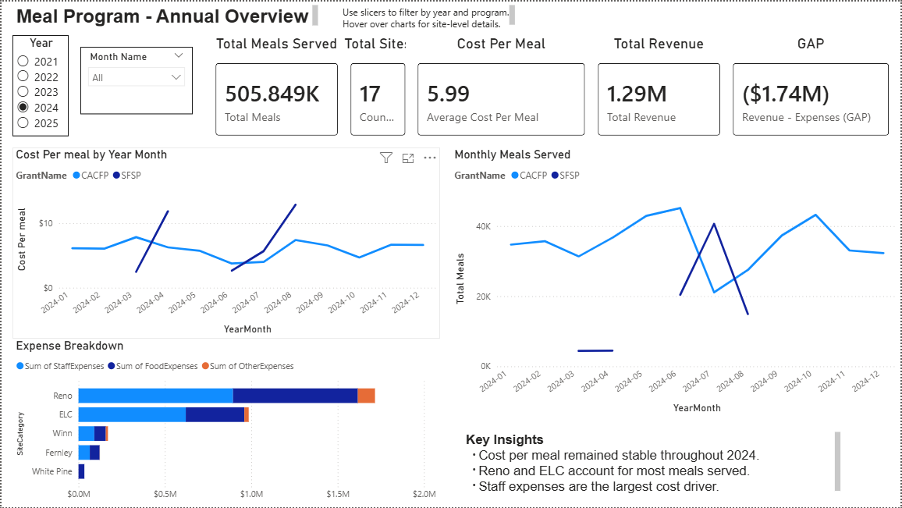

# Power-BI-Meal-Program

## Overview
This project analyzes meal service volume and cost efficiency across sites and programs over time.  
The report focuses on meal counts, expenses, revenue, and cost per meal by month, program, and site.

> **Data Privacy Notice:** The dataset and report shared here are anonymized and modified to protect sensitive organizational information. Site names and identifiers have been replaced (e.g., Site A, Site B), and values may be adjusted while preserving analytical structure.

---

## Business Questions Answered
1. **How has cost per meal changed over time by program?**
2. **Which sites have the highest cost per meal (and how does that relate to volume)?**
3. **What drives expenses across sites (Food vs Staff vs Other)?**
4. **How do revenue and expenses compare over time?**

---

## Dashboard Pages

### 1) Annual Overview
- KPI summary (meals, revenue, expenses, cost per meal)
- Cost per meal trend by program
- Expense breakdown by site category  

### 2) Monthly Trends
- Meals served trend by month
- Cost per meal trend by month
- Revenue vs expenses trend  

### 3) Site Performance
- Cost per meal by site ranking
- Efficiency scatter: meals served vs cost per meal
- (Optional) expense breakdown by site  

---

## Data Model (Star Schema)
- **Fact:** Meals + Expenses by date, program, grant year, site  
- **Dimensions:** Date, Site, Program, Grant Year

---

## Key Measures (DAX)
- Total Meals
- Total Revenue
- Total Expenses
- Cost per Meal = Total Expenses / Total Meals
- Revenue – Expenses

---

## Tools Used
- Power BI Desktop (Power Query, data modeling, DAX, report design)
- Excel (source data; anonymized for public sharing)

---

## How to Use
- View screenshots in `/images`.

---

## Notes / Lessons Learned
- Built a star schema from a single Excel source using referenced queries.
- Used measures (DAX) instead of calculated columns for scalable metrics.
- Validated the model with “truth visuals” before building the final dashboard.
